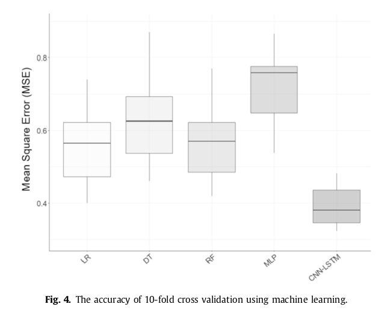

# How To Use

1. Clone the github repository `git clone https://github.com/a-elhag/forecasting`

2. Run `forecasting/src/preprocessing.py` to preprocess the data in	`forecasting/data` 
(*only needs to be run once to convert the data from .txt to .h5*)

3. Run `forecasting/src/pipeline.py` to run the following ML algorithms:

	a. Linear Regression

	b. Decision Trees

	c. Multi-Layer Perceptron

# My Outputs

|Models | Train/Test | RMSE (kW) |
| ----- | ---------- | --------- |
| Linear| Train | 0.90493926 |
| Linear| Test | 0.81354757 |
| Decision Tree| Train | 0.88600988 |
| Decision Tree| Test | 0.79743887 |
| MLP| Train | 1.16646768 |
| MLP| Test | 1.00909918 |

# Paper's Outputs

